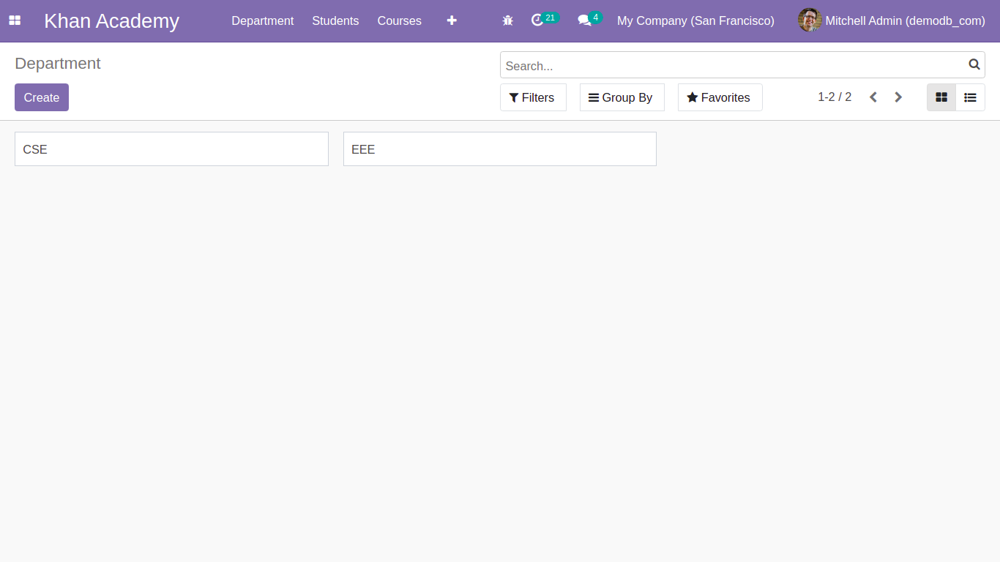
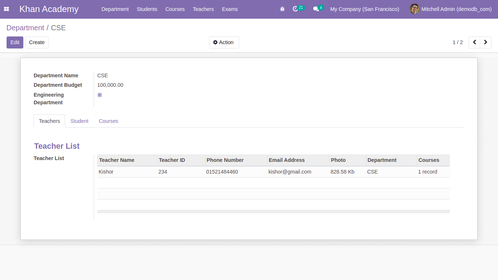
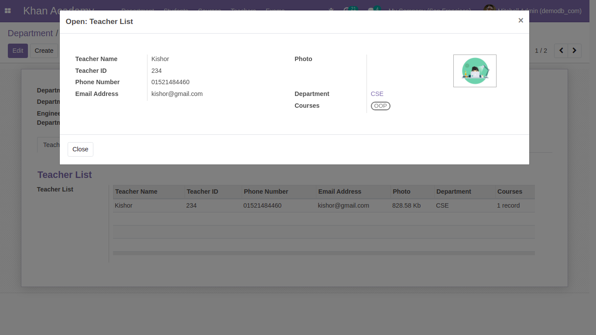
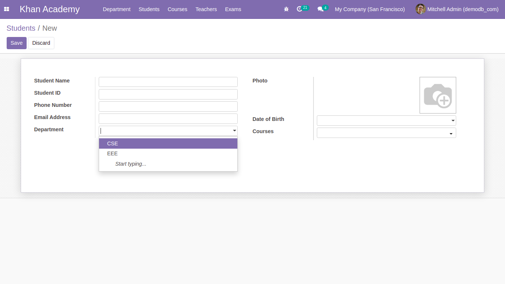
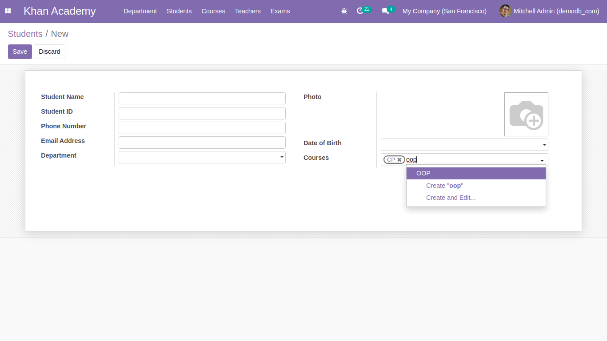
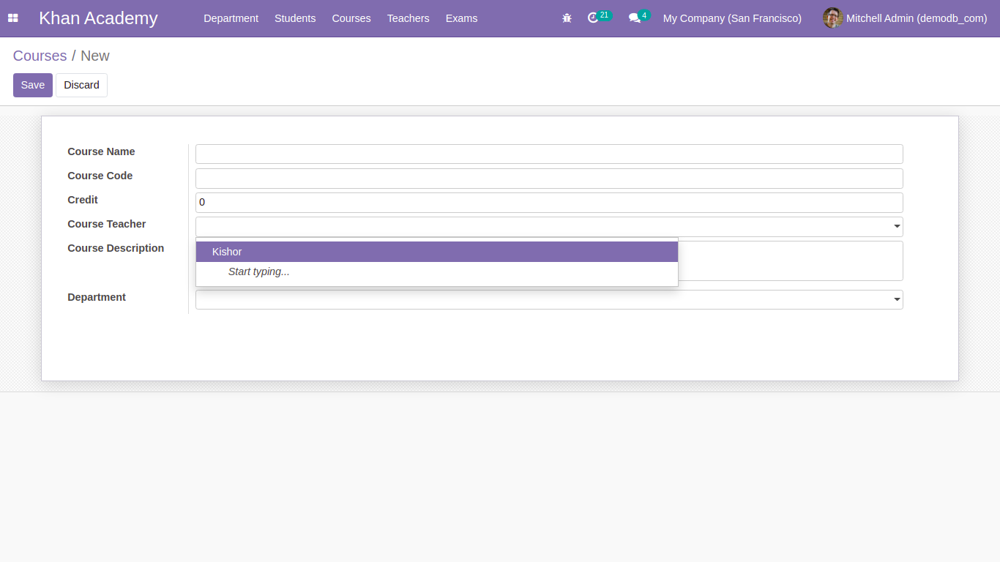
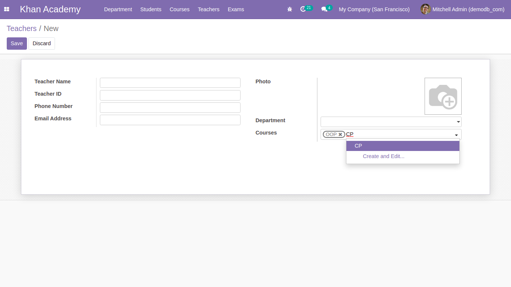
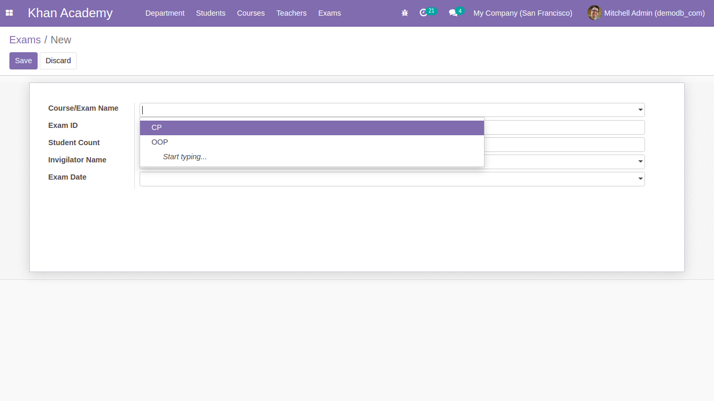

# khan-academy-odoo

Created an academy module where there are 5 menus for Departments, Students, Teachers, Courses, Exams.
Each menu have different views (Tree, Form, search).

## 0. Departments model & view:

Here all the departments information will show and there is an option for creating new department information.
One2many: One department have many teachers, students and courses.
View all the information when clicking on the specific data.

## 1. Students model & view:

Here all the students information will show and there is an option for creating new student information.
Many2one: student model with department --> One department has multiple students
Many2many: student model with course --> One course has multiple students and one student can take multiple courses.

## 2. Courses model & view:

Here all the courses information will show and there is an option for creating new course information.
Many2one: course model with department --> One department has multiple courses
course model with teacher --> One teacher can take multiple courses

## 3. Teachers model & view:

Here all the teachers information will show and there is an option for creating new teacher information.
Many2one: teacher model with department --> One department has multiple teachers
Many2many: teacher model with course --> one teacher can take multiple courses.

## 4. Exams model & view:

Here all the exams information will show and there is an option for creating new exam information.
Many2one: exam model with course --> One course has multiple exams
exam model with teacher --> One teacher can take multiple exams

