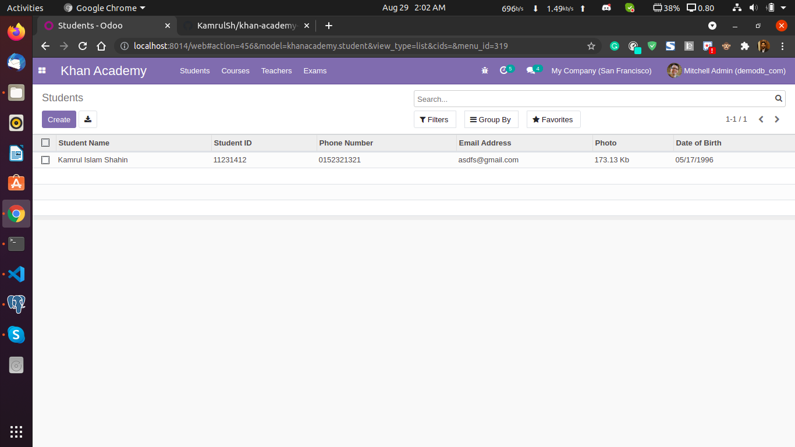
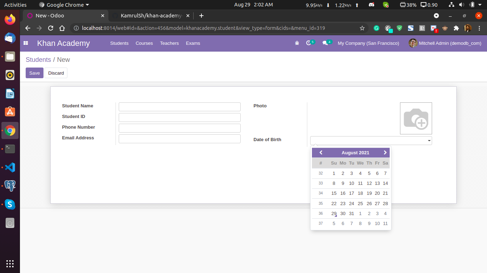
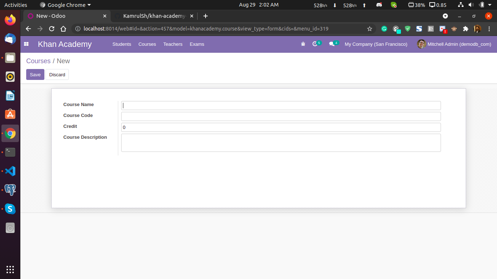
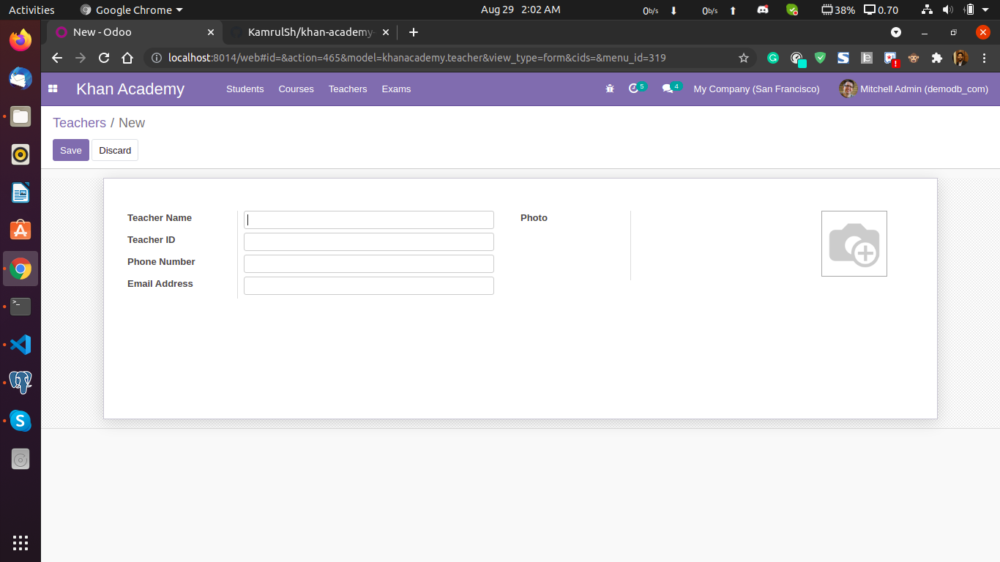
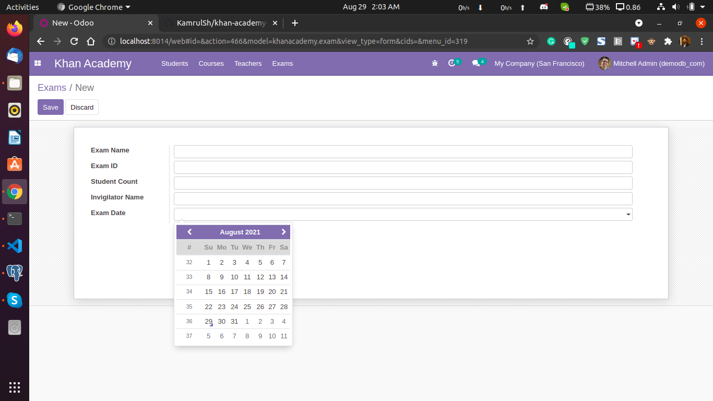

# khan-academy-odoo

Created an academy module where there are 4 menus for Students, Teachers, Courses, Exams.
Each menu have different views (Tree, Form, search).

## 1. Students model & view: Here all the students information will show and there is an option for creating new student information.

## 2. Courses model & view: Here all the courses information will show and there is an option for creating new course information.

## 3. Teachers model & view: Here all the teachers information will show and there is an option for creating new teacher information.

## 4. Exams model & view: Here all the exams information will show and there is an option for creating new exam information.

